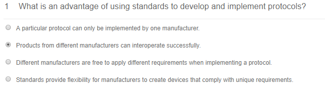
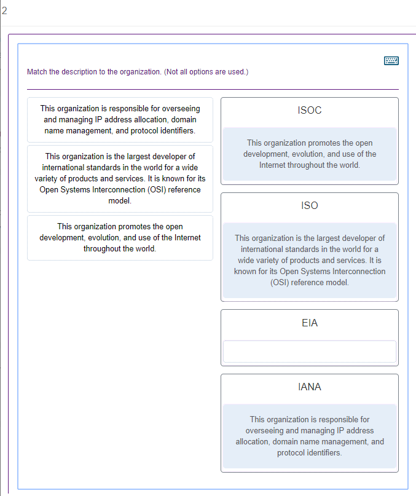
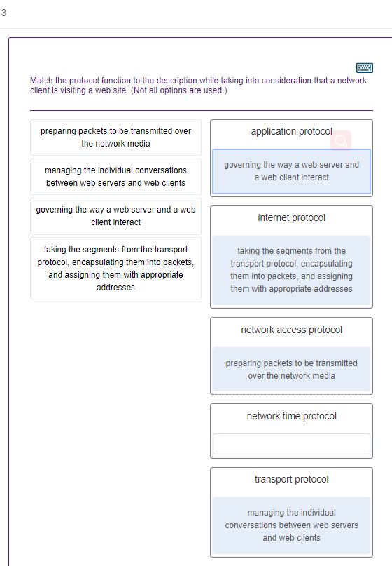
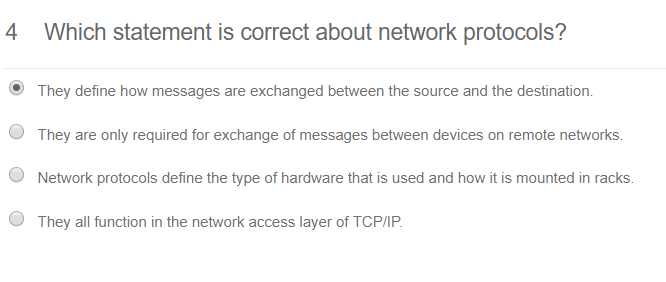
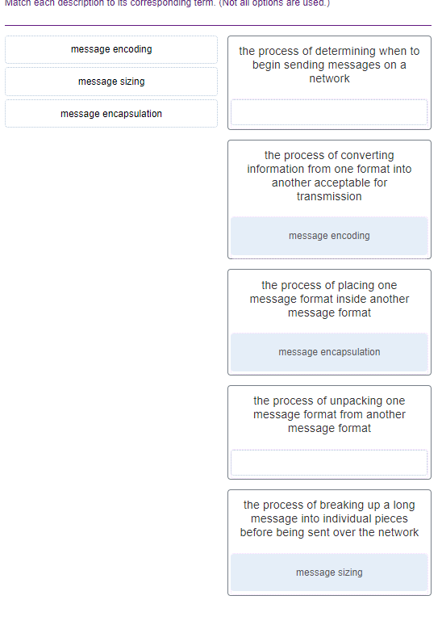

[答案1](https://quizlet.com/121264708/chapter-3-network-protocols-and-communications-flash-cards/)

[答案2](https://quizlet.com/33079970/chapter-3-exam-flash-cards/)

https://www.ccna7.com/ccna1-v5-1/ccna1-chapter-3-exam-v5-1/

5

Which statement is true about the TCP/IP and OSI models?

- **The TCP/IP transport layer and OSI Layer 4 provide similar services and functions.**

- The TCP/IP network access layer has similar functions to the OSI network layer.

- The OSI Layer 7 and the TCP/IP application layer provide identical functions.

- The first three OSI layers describe general services that are also provided by the TCP/IP internet layer.

  

6

### What are proprietary protocols?

- protocols developed by private organizations to operate on any vendor hardware

- protocols that can be freely used by any organization or vendor

- **protocols developed by organizations who have control over their definition and operation**

- a collection of protocols known as the TCP/IP protocol suite

  

7

### What will happen if the default gateway address is incorrectly configured on a host?

- The host cannot communicate with other hosts in the local network.

- The switch will not forward packets initiated by the host.

- The host will have to use ARP to determine the correct address of the default gateway.

- **The host cannot communicate with hosts in other networks.**

- A ping from the host to 127.0.0.1 would not be successful.

  

8

### What process is used to place one message inside another message for transfer from the source to the destination?

- access control

- decoding

- **encapsulation**

- flow control

  

9

### Which PDU is processed when a host computer is de-encapsulating a message at the transport layer of the TCP/IP model?

- bits

- frame

- packet

- **segment**

  

10

### What method can be used by two computers to ensure that packets are not dropped because too much data is being sent too quickly?

- encapsulation

- **flow control**

- access method

- response timeout

  

11

### What three application layer protocols are part of the TCP/IP protocol suite? (Choose three.)

- ARP

- **DHCP**

- **DNS**

- **FTP**

- NAT

- PPP

  

12

At which layer of the OSI model would a logical address be added during encapsulation?

- transport layer

- physical layer

- data link layer

- **network layer**

  

13

### Which address does a NIC use when deciding whether to accept a frame?

- source IP address
- source MAC address
- destination IP address
- **destination MAC address**
- source Ethernet address

14

### What type of communication will send a message to all devices on a local area network?

- **broadcast**

- multicast

- unicast

- allcast

  

15

Refer to the exhibit. If Host1 were to transfer a file to the server, what layers of the TCP/IP model would be used?

- only application, transport, network, data link, and physical layers
- only application and Internet layers
- **application, transport, Internet, and network access layers**
- only application, Internet, and network access layers
- application, session, transport, network, data link, and physical layers
- only Internet and network access layers

16

Which PDU format is used when bits are received from the network medium by the NIC of a host?

- file
- segment
- packet
- **frame**

17

### Which characteristic describes the default gateway of a host computer?

- **the logical address of the router interface on the same network as the host computer**

- the physical address of the switch interface connected to the host computer

- the physical address of the router interface on the same network as the host computer

- the logical address assigned to the switch interface connected to the router

  

18

What is an advantage of network devices using open standard protocols?

- **A client host and a server running different operating systems can successfully exchange data.**
- Internet access can be controlled by a single ISP in each market.
- Competition and innovation are limited to specific types of products.
- Network communications is confined to data transfers between devices from the same vendor.
- [Navigation Bar](javascript:document.querySelector('.current button').focus();)

19

### A web client is sending a request for a webpage to a web server. From the perspective of the client, what is the correct order of the protocol stack that is used to prepare the request for transmission?

- HTTP, IP, TCP, Ethernet

- **HTTP, TCP, IP, Ethernet**

- Ethernet, TCP, IP, HTTP

- Ethernet, IP, TCP, HTTP

  

20

21

### Which three layers of the OSI model are comparable in function to the application layer of the TCP/IP model? (Choose three.)

- **application**

- **presentation**

- **session**

- transport

- data link

- physical

- network

  

22

### Refer to the exhibit. HostA is attempting to contact ServerB. Which two statements correctly describe the addressing that HostA will generate in the process? (Choose two.)

- A packet with the destination IP address of RouterB.

- A frame with the destination MAC address of SwitchA.

- A packet with the destination IP address of RouterA.

- **A frame with the destination MAC address of RouterA.**

- **A packet with the destination IP address of ServerB.**

- A frame with the destination MAC address of ServerB.

  

23